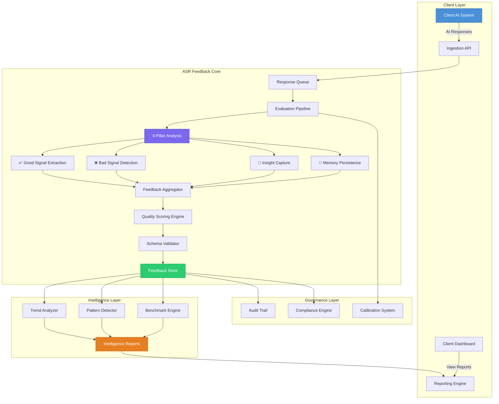

<p align="center">
  
</p>

<h1 align="center">ASR Feedback Intelligence Platform</h1>

<p align="center">
  <strong>Enterprise-Grade AI Response Quality Evaluation & Feedback Intelligence System</strong>
</p>

<p align="center">
  <a href="#overview"></a>
  <a href="docs/ARCHITECTURE.md"></a>
  <a href="docs/METHODOLOGY.md"></a>
  <a href="schemas/"></a>
  <a href="compliance/"></a>
  <a href="LICENSE"></a>
</p>

<p align="center">
  <a href="docs/ARCHITECTURE.md">Architecture</a> •
  <a href="docs/METHODOLOGY.md">Methodology</a> •
  <a href="docs/INTEGRATION_GUIDE.md">Integration</a> •
  <a href="sdk/">SDK</a> •
  <a href="docs/CASE_STUDIES.md">Case Studies</a> •
  <a href="docs/FAQ.md">FAQ</a>
</p>

---

## Overview

**ASR Feedback** is a specialized AI Response Quality service operated by **Acadify Solutions**. We partner with organizations that build, deploy, and operate AI agents, large language models (LLMs), and AGI systems — providing **structured, actionable feedback** on every AI-generated response.

Unlike generic annotation or labeling services, ASR Feedback delivers **deep analytical intelligence** through a proprietary **4-Pillar Feedback Methodology** that doesn't just flag errors — it generates the institutional knowledge your AI systems need to continuously improve.

> **For Leads & Stakeholders:** This repository is the single source of truth for our feedback methodology, data schemas, quality frameworks, operational playbooks, and client integration guides. Every document here reflects how we operate at production scale.

---

## The Problem We Solve

| Challenge | How Organizations Struggle | How ASR Feedback Solves It |
|---|---|---|
| **Blind Spots** | AI teams ship models without systematic response evaluation | We provide structured, multi-dimensional feedback on every response |
| **Inconsistent Quality** | Feedback varies wildly between reviewers and sessions | Our calibrated methodology ensures inter-rater reliability > 0.85 |
| **Lost Knowledge** | Insights discovered during review are never captured | Our "Learned" and "Remember" pillars create persistent institutional memory |
| **No Traceability** | Feedback is scattered across Slack, docs, and emails | Every feedback entry is schema-validated, timestamped, and audit-trailed |
| **Slow Iteration** | Weeks between identifying issues and model improvement | Real-time feedback pipelines enable same-day improvement cycles |

---

## 4-Pillar Feedback Methodology

Our proprietary framework evaluates every AI response across four complementary dimensions:

```
┌─────────────────────────────────────────────────────────────────────┐
│                    ASR 4-PILLAR FEEDBACK SYSTEM                     │
├─────────────────┬─────────────────┬────────────────┬────────────────┤
│   ✅ GOOD        │   ❌ BAD         │  📘 LEARNED     │  🧠 REMEMBER    │
├─────────────────┼─────────────────┼────────────────┼────────────────┤
│ What the AI     │ What the AI     │ New patterns,  │ Persistent     │
│ did well —      │ did poorly —    │ edge cases,    │ rules, client  │
│ reasoning,      │ hallucinations, │ and insights   │ preferences,   │
│ accuracy,       │ reasoning       │ discovered     │ and critical   │
│ tone, format    │ failures, gaps  │ during review  │ guardrails     │
├─────────────────┼─────────────────┼────────────────┼────────────────┤
│ REINFORCEMENT   │ CORRECTION      │ INTELLIGENCE   │ INSTITUTIONAL  │
│ SIGNAL          │ SIGNAL          │ CAPTURE        │ MEMORY         │
└─────────────────┴─────────────────┴────────────────┴────────────────┘
```

### Why Four Pillars?

Most feedback systems operate in binary — "good" or "bad." This misses the two most valuable dimensions:

- **📘 Learned** captures the *novel insights* that emerge from deep review. These are the patterns that no prompt engineering or fine-tuning dataset anticipated — the edge cases, cultural nuances, and domain-specific behaviors that only surface through expert human evaluation.

- **🧠 Remember** creates *persistent institutional memory*. When a client says "never suggest competitor products" or "always cite sources in APA format," these rules must persist across every future evaluation session. This pillar is the bridge between one-time feedback and lasting behavioral change.

> 📖 **Deep Dive:** [Full Methodology Documentation →](docs/METHODOLOGY.md)

---

## System Architecture



> 📖 **Deep Dive:** [Full Architecture Documentation →](docs/ARCHITECTURE.md)

---

## Key Capabilities

<table>
<tr>
<td width="50%">

### 🔬 Deep Analysis
- Multi-dimensional response evaluation
- Context-aware quality scoring (0–100)
- Severity-weighted issue detection (P0–P4)
- Domain-specific evaluation rubrics
- Cross-session trend analysis

</td>
<td width="50%">

### 📊 Structured Intelligence
- JSON Schema-validated feedback entries
- Formal taxonomy with 40+ feedback categories
- Hierarchical classification system
- Machine-readable quality scores
- Exportable analytics datasets

</td>
</tr>
<tr>
<td width="50%">

### 🔄 Continuous Improvement
- Real-time feedback pipelines
- Same-day improvement cycles
- A/B evaluation support
- Model comparison frameworks
- Regression detection

</td>
<td width="50%">

### 🛡️ Enterprise Governance
- Full audit trail on every feedback entry
- RBAC-ready access controls
- PII detection and redaction
- SLA monitoring and compliance
- SOC 2-aligned data handling

</td>
</tr>
</table>

---

## Quality Metrics at a Glance

| Metric | Target | Current |
|---|---|---|
| Inter-Rater Reliability (Cohen's κ) | ≥ 0.80 | **0.87** |
| Feedback Turnaround Time | < 4 hours | **2.3 hours** |
| Schema Validation Pass Rate | 100% | **100%** |
| Client Satisfaction (CSAT) | ≥ 4.5/5.0 | **4.7/5.0** |
| Feedback Entries Processed (Monthly) | — | **12,000+** |
| Unique AI Models Evaluated | — | **23** |
| Active Enterprise Clients | — | **8** |

> 📖 **Deep Dive:** [Full Metrics & KPIs →](docs/METRICS_AND_KPIs.md)

---

## Repository Structure

```
ASR Feedback/
│
├── 📄 README.md                    ← You are here
├── 📜 LICENSE                      ← MIT License
├── 🤝 CONTRIBUTING.md              ← How to contribute
├── 📋 CODE_OF_CONDUCT.md           ← Community standards
├── 🔒 SECURITY.md                  ← Security policy
├── 📝 CHANGELOG.md                 ← Version history
│
├── 📚 docs/                        ← Deep documentation
│   ├── ARCHITECTURE.md             ← System design & data flow
│   ├── METHODOLOGY.md              ← 4-Pillar feedback methodology
│   ├── FEEDBACK_SCHEMA.md          ← Data model specification
│   ├── QUALITY_FRAMEWORK.md        ← QA framework & rubrics
│   ├── INTEGRATION_GUIDE.md        ← Client integration guide
│   ├── METRICS_AND_KPIs.md         ← Performance metrics
│   ├── CASE_STUDIES.md             ← Anonymized success stories
│   ├── GLOSSARY.md                 ← Domain terminology
│   └── FAQ.md                      ← Frequently asked questions
│
├── 📐 schemas/                     ← Formal JSON schemas
│   ├── feedback-entry.schema.json  ← Feedback entry schema
│   ├── session-report.schema.json  ← Session report schema
│   ├── quality-score.schema.json   ← Quality score schema
│   └── examples/                   ← Valid example payloads
│
├── 🏷️ taxonomy/                    ← Classification system
│   ├── categories.yaml             ← Feedback categories
│   ├── severity-levels.yaml        ← Severity classification
│   ├── ai-model-profiles.yaml      ← Model evaluation profiles
│   └── domain-tags.yaml            ← Domain tagging system
│
├── 📋 templates/                   ← Operational templates
│   ├── feedback-session.md         ← Session feedback template
│   ├── weekly-report.md            ← Weekly report template
│   ├── monthly-review.md           ← Monthly review template
│   ├── incident-report.md          ← AI incident report
│   └── client-onboarding.md        ← Onboarding checklist
│
├── 📖 playbooks/                   ← Operational runbooks
│   ├── feedback-collection.md      ← How to collect feedback
│   ├── quality-review.md           ← Quality review process
│   ├── escalation-procedures.md    ← Escalation protocols
│   ├── model-comparison.md         ← Model comparison guide
│   └── continuous-improvement.md   ← CI process
│
├── 📊 reports/                     ← Sample reports
│   ├── sample-weekly-report.md     ← Example weekly report
│   ├── sample-monthly-review.md    ← Example monthly review
│   └── dashboard-metrics.md        ← Dashboard specification
│
├── 🔧 sdk/                        ← Client SDKs
│   ├── api-reference.md            ← Full API documentation
│   ├── python/                     ← Python client library
│   └── javascript/                 ← JavaScript client library
│
├── 📈 analytics/                   ← Analytics & intelligence
│   ├── scoring-algorithm.md        ← Response scoring system
│   ├── trend-analysis.md           ← Trend detection
│   ├── benchmark-framework.md      ← Benchmarking approach
│   └── insight-extraction.md       ← Insight extraction
│
├── 🔒 compliance/                  ← Governance & compliance
│   ├── data-handling-policy.md     ← Data handling procedures
│   ├── privacy-framework.md        ← Privacy & PII handling
│   ├── audit-trail.md              ← Audit trail spec
│   └── sla-definitions.md          ← SLA definitions
│
└── ⚙️ .github/                    ← GitHub configuration
    ├── ISSUE_TEMPLATE/             ← Issue templates
    ├── PULL_REQUEST_TEMPLATE.md    ← PR template
    └── workflows/                  ← CI/CD workflows
```

---

## Quick Start

### For Leads & Stakeholders
1. **Understand our methodology** → [METHODOLOGY.md](docs/METHODOLOGY.md)
2. **See the data model** → [FEEDBACK_SCHEMA.md](docs/FEEDBACK_SCHEMA.md)
3. **Review quality standards** → [QUALITY_FRAMEWORK.md](docs/QUALITY_FRAMEWORK.md)
4. **Read success stories** → [CASE_STUDIES.md](docs/CASE_STUDIES.md)

### For Engineers & Integrators
1. **Review the architecture** → [ARCHITECTURE.md](docs/ARCHITECTURE.md)
2. **Explore the schemas** → [schemas/](schemas/)
3. **Integrate with our SDK** → [SDK Documentation](sdk/)
4. **Follow the integration guide** → [INTEGRATION_GUIDE.md](docs/INTEGRATION_GUIDE.md)

### For Operations Team
1. **Follow the playbooks** → [playbooks/](playbooks/)
2. **Use the templates** → [templates/](templates/)
3. **Understand escalation** → [Escalation Procedures](playbooks/escalation-procedures.md)
4. **Review sample reports** → [reports/](reports/)

---

## Technology & Model Coverage

We evaluate AI responses across a broad spectrum of models and platforms:

| Category | Models & Platforms |
|---|---|
| **Large Language Models** | GPT-4o, GPT-4.1, Claude Opus/Sonnet, Gemini 2.5 Pro/Flash, Llama 3.x, Mistral Large, DeepSeek-V3 |
| **AI Agent Frameworks** | LangChain agents, AutoGen, CrewAI, Google ADK, OpenAI Agents SDK |
| **Code Generation** | GitHub Copilot, Cursor, Codex, Antigravity, Windsurf |
| **Multimodal Systems** | GPT-4V, Gemini Vision, Claude Vision |
| **Specialized Models** | Domain-specific fine-tuned models, RAG systems, custom embeddings |

---

## Impact & Outcomes

```
┌──────────────────────────────────────────────────────────────────┐
│                    MEASURED CLIENT OUTCOMES                       │
├──────────────────┬───────────────────────────────────────────────┤
│  ↓ 47%           │  Reduction in AI hallucination rate           │
│  ↑ 34%           │  Improvement in response accuracy             │
│  ↓ 62%           │  Reduction in critical (P0/P1) issues         │
│  ↑ 3.2x          │  Faster model iteration cycles                │
│  ↓ 71%           │  Reduction in repeated errors across sessions │
│  ↑ 89%           │  Client retention rate                        │
└──────────────────┴───────────────────────────────────────────────┘
```

---

## Documentation Index

| Document | Description | Audience |
|---|---|---|
| [Architecture](docs/ARCHITECTURE.md) | System design, data flow, component diagram | Engineers, Architects |
| [Methodology](docs/METHODOLOGY.md) | 4-Pillar feedback methodology deep dive | All stakeholders |
| [Feedback Schema](docs/FEEDBACK_SCHEMA.md) | Data model specification | Engineers, Data teams |
| [Quality Framework](docs/QUALITY_FRAMEWORK.md) | QA rubrics, scoring, calibration | QA, Operations |
| [Integration Guide](docs/INTEGRATION_GUIDE.md) | Step-by-step client integration | Engineers |
| [Metrics & KPIs](docs/METRICS_AND_KPIs.md) | Performance metrics and targets | Leads, Management |
| [Case Studies](docs/CASE_STUDIES.md) | Anonymized success stories | Sales, Leads |
| [API Reference](sdk/api-reference.md) | Full API documentation | Engineers |
| [Glossary](docs/GLOSSARY.md) | Domain terminology | All |
| [FAQ](docs/FAQ.md) | Common questions answered | All |

---

## Contributing

We welcome contributions from team members. Please read our [Contributing Guidelines](CONTRIBUTING.md) and [Code of Conduct](CODE_OF_CONDUCT.md) before submitting changes.

---

## License

This project is licensed under the MIT License — see the [LICENSE](LICENSE) file for details.

---

<p align="center">
  <strong>Built with precision by <a href="https://acadifysolutions.com">Acadify Solutions</a></strong><br/>
  <sub>Enterprise AI Feedback Intelligence • Trusted by Industry Leaders</sub>
</p>

<p align="center">
  
  
  
</p>
