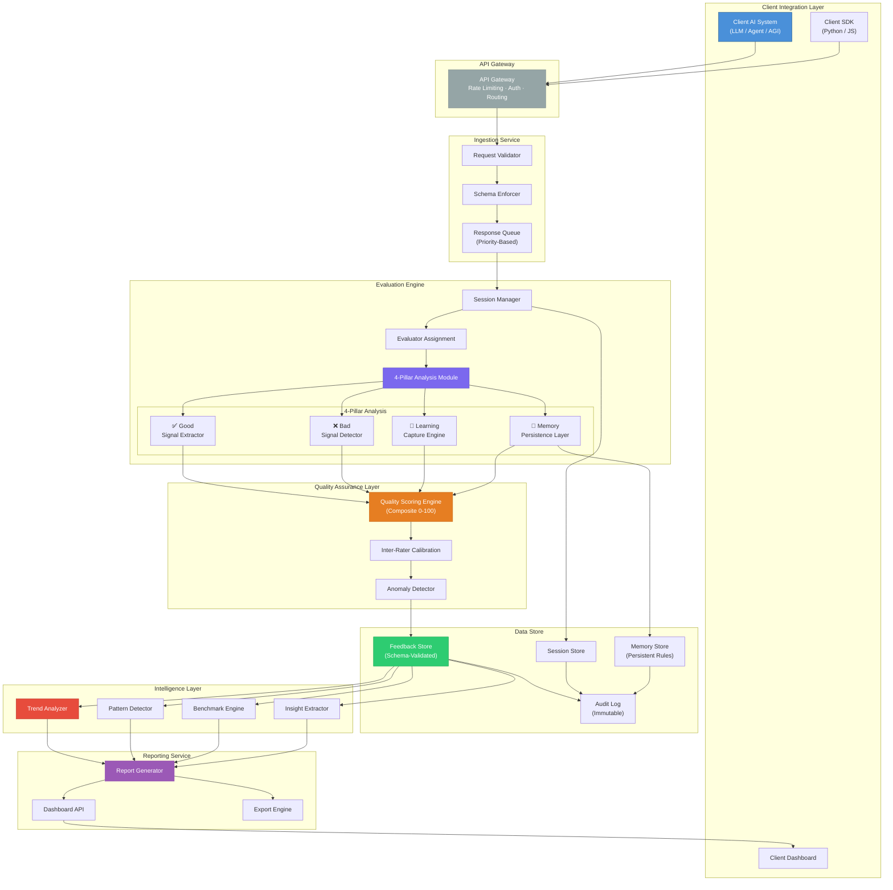
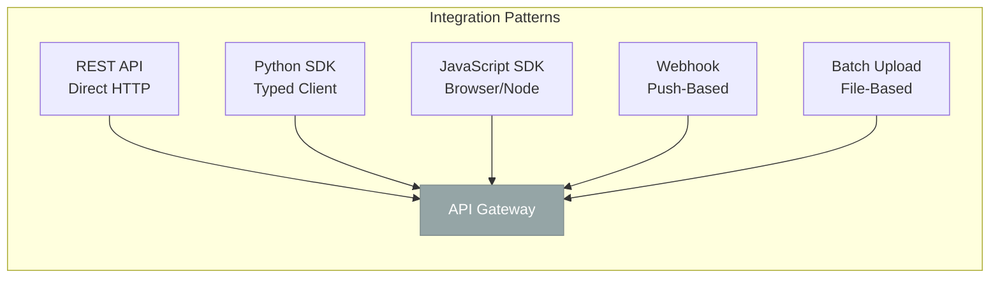
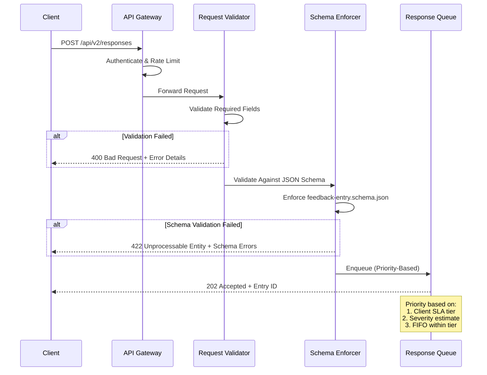
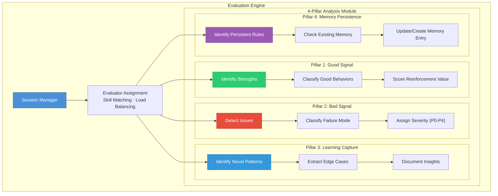
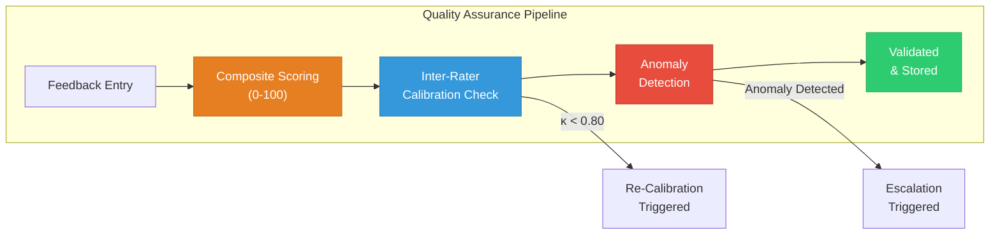
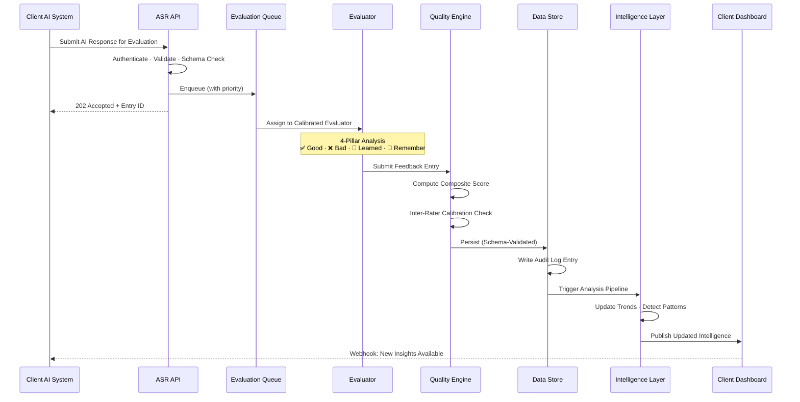
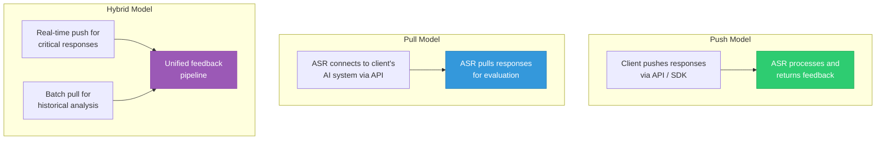
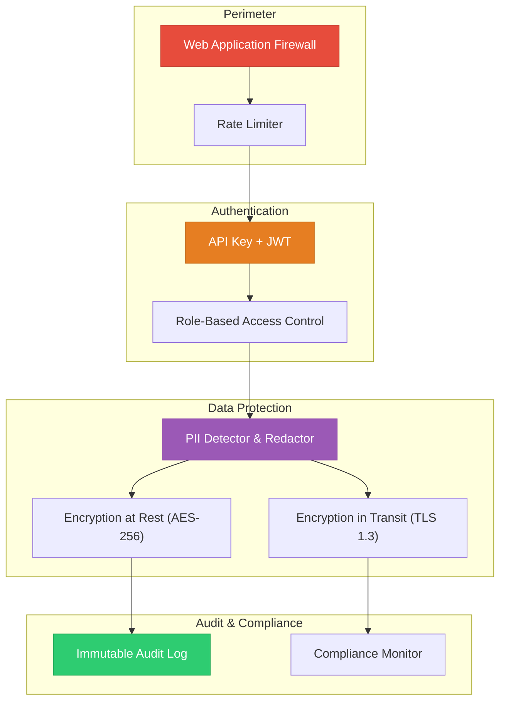

# System Architecture

> **Document Version:** 2.3.0 | **Last Updated:** 2026-07-01 | **Author:** ASR Engineering Team

---

## Table of Contents

- [Overview](#overview)
- [Design Principles](#design-principles)
- [High-Level Architecture](#high-level-architecture)
- [Component Deep Dive](#component-deep-dive)
- [Data Flow](#data-flow)
- [Integration Architecture](#integration-architecture)
- [Scalability & Performance](#scalability--performance)
- [Security Architecture](#security-architecture)
- [Technology Stack](#technology-stack)

---

## Overview

The ASR Feedback Intelligence Platform is designed as a **modular, event-driven system** that ingests AI-generated responses, orchestrates multi-dimensional evaluation through our 4-Pillar methodology, and produces structured intelligence outputs. The architecture prioritizes **auditability**, **schema integrity**, and **extensibility** — ensuring that every feedback entry is traceable, validated, and actionable.

---

## Design Principles

| Principle | Description |
|---|---|
| **Schema-First** | Every data entity is defined by a formal JSON Schema before any code is written. The schema is the contract. |
| **Immutable Audit Trail** | Every feedback entry, score, and decision is logged immutably. Nothing is silently overwritten. |
| **Separation of Concerns** | Ingestion, evaluation, scoring, storage, and reporting are independent, composable services. |
| **Backward Compatibility** | Schema changes are additive by default. Breaking changes trigger major version bumps with migration paths. |
| **Defense in Depth** | Security is layered — input validation, schema enforcement, access controls, PII detection, and audit logging. |
| **Human-in-the-Loop** | The system augments human evaluators, never replaces them. Every automated signal is reviewed by a calibrated analyst. |

---

## High-Level Architecture



---

## Component Deep Dive

### 1. Client Integration Layer

The entry point for all client interactions. Supports multiple integration patterns:



| Pattern | Use Case | Latency | Volume |
|---|---|---|---|
| REST API | Real-time, single-entry submission | < 200ms | Low-Medium |
| Python SDK | Programmatic integration, pipelines | < 200ms | Medium-High |
| JavaScript SDK | Browser dashboards, web apps | < 200ms | Low-Medium |
| Webhook | Event-driven, automated triggers | Async | Medium |
| Batch Upload | Historical data, bulk migration | Async | High |

---

### 2. Ingestion Service

Responsible for receiving, validating, and queuing AI responses for evaluation.



**Key Design Decisions:**

- **Asynchronous Processing:** Responses are queued for evaluation, not processed synchronously. This decouples ingestion throughput from evaluation capacity.
- **Schema Enforcement at Ingestion:** Invalid data is rejected immediately — malformed entries never enter the evaluation pipeline.
- **Priority Queuing:** Enterprise clients with critical SLAs receive priority evaluation without starving standard-tier clients.

---

### 3. Evaluation Engine

The core of the platform — where AI responses are analyzed through our 4-Pillar methodology.



**Evaluator Assignment Algorithm:**

```
1. Incoming response arrives from queue
2. Extract: domain, model_type, language, complexity_estimate
3. Match available evaluators by:
   a. Domain expertise (required match)
   b. Model familiarity (preferred match)
   c. Current workload (load balancing)
   d. Calibration score (minimum threshold: 0.80)
4. Assign to best-fit evaluator
5. Start session timer (SLA tracking)
```

---

### 4. Quality Assurance Layer

Ensures consistency and accuracy across all evaluations.



**Composite Score Calculation:**

```
CompositeScore = (
    GoodSignalScore × W_good +
    BadSignalPenalty × W_bad +
    SeverityImpact × W_severity +
    CompletenessScore × W_completeness +
    ConsistencyScore × W_consistency
)

Where:
  W_good         = 0.25  (configurable per client)
  W_bad          = 0.30
  W_severity     = 0.20
  W_completeness = 0.15
  W_consistency  = 0.10
```

---

### 5. Data Store

A multi-model storage layer optimized for different access patterns.

| Store | Purpose | Access Pattern | Retention |
|---|---|---|---|
| **Feedback Store** | Individual feedback entries | Write-heavy, read-by-session | 24 months |
| **Session Store** | Evaluation session metadata | Write-once, read-many | 36 months |
| **Memory Store** | Persistent rules & preferences | Read-heavy, write-on-change | Indefinite |
| **Audit Log** | Immutable activity trail | Append-only, read-for-compliance | 7 years |

---

### 6. Intelligence Layer

Transforms raw feedback data into actionable intelligence.

| Component | Input | Output | Frequency |
|---|---|---|---|
| **Trend Analyzer** | Feedback entries over time | Trend reports, regression alerts | Daily / Weekly |
| **Pattern Detector** | Clustered feedback entries | Common failure patterns, recurring strengths | Weekly |
| **Benchmark Engine** | Cross-model quality scores | Comparative benchmarks, rankings | Monthly |
| **Insight Extractor** | Learned + Remember entries | Institutional knowledge base | Continuous |

---

## Data Flow

### End-to-End Request Lifecycle



---

## Integration Architecture

### Supported Integration Models



---

## Scalability & Performance

### Capacity Targets

| Metric | Current | Target (2026 H2) |
|---|---|---|
| Entries/hour (sustained) | 500 | 2,000 |
| Entries/hour (burst) | 1,500 | 5,000 |
| P99 ingestion latency | 180ms | 100ms |
| Evaluation turnaround (P50) | 2.3 hours | 1.5 hours |
| Evaluation turnaround (P99) | 6 hours | 4 hours |
| Concurrent sessions | 50 | 200 |
| Storage (monthly growth) | 12 GB | 50 GB |

### Horizontal Scaling Strategy

```
Ingestion Service    → Stateless, scale by adding instances
Evaluation Engine    → Scale by adding evaluators (human + assisted)
Quality Engine       → Stateless computation, scale horizontally
Data Store           → Sharded by client_id, replicated for reads
Intelligence Layer   → Batch processing, scale by compute allocation
Reporting Service    → Cached results, scale by CDN/cache layer
```

---

## Security Architecture



---

## Technology Stack

| Layer | Technology | Rationale |
|---|---|---|
| **API Gateway** | Kong / AWS API Gateway | Rate limiting, auth, routing |
| **Backend Services** | Python (FastAPI) | Type safety, async support, ML ecosystem |
| **Queue** | Redis Streams / SQS | Priority queuing, reliability |
| **Primary Database** | PostgreSQL | ACID compliance, JSON support, mature ecosystem |
| **Document Store** | MongoDB | Flexible schema for feedback entries |
| **Cache** | Redis | Session caching, leaderboard computation |
| **Search** | Elasticsearch | Full-text search across feedback corpus |
| **Object Storage** | S3 / GCS | Attachments, exports, backups |
| **Monitoring** | Prometheus + Grafana | Metrics, alerting, dashboards |
| **CI/CD** | GitHub Actions | Schema validation, doc linting |
| **SDK Languages** | Python, JavaScript | Client library support |

---

> **See Also:**
> - [Methodology →](METHODOLOGY.md)
> - [Feedback Schema →](FEEDBACK_SCHEMA.md)
> - [Integration Guide →](INTEGRATION_GUIDE.md)
> - [Quality Framework →](QUALITY_FRAMEWORK.md)
