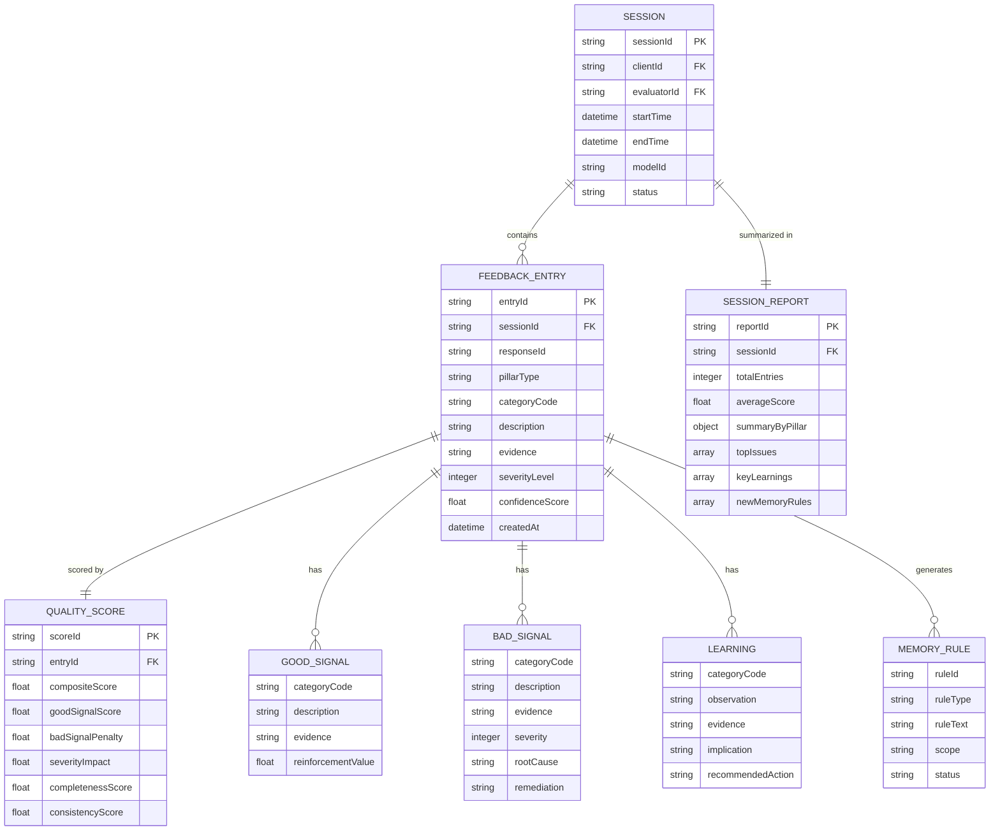
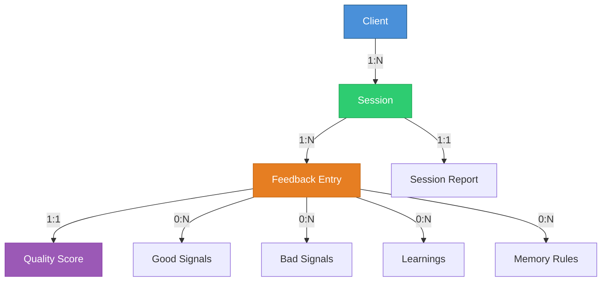

# Feedback Schema Specification

> **Document Version:** 2.3.0 | **Last Updated:** 2026-07-01 | **Schema Draft:** JSON Schema Draft 7

---

## Table of Contents

- [Overview](#overview)
- [Core Entities](#core-entities)
- [Feedback Entry Schema](#feedback-entry-schema)
- [Session Report Schema](#session-report-schema)
- [Quality Score Schema](#quality-score-schema)
- [Field Reference](#field-reference)
- [Relationships](#relationships)
- [Validation Rules](#validation-rules)

---

## Overview

All data in the ASR Feedback platform is governed by formal **JSON Schemas** (Draft 7). These schemas serve as:

1. **The contract** between clients and our platform
2. **The validation layer** — no data enters the system without passing schema validation
3. **The documentation** — every field is typed, described, and exampled

### Schema Files

| Schema | File | Purpose |
|---|---|---|
| Feedback Entry | [`feedback-entry.schema.json`](../schemas/feedback-entry.schema.json) | Individual feedback annotation |
| Session Report | [`session-report.schema.json`](../schemas/session-report.schema.json) | Session-level aggregated report |
| Quality Score | [`quality-score.schema.json`](../schemas/quality-score.schema.json) | Composite quality scoring |

---

## Core Entities



---

## Feedback Entry Schema

The **Feedback Entry** is the atomic unit of the ASR Feedback system. Every annotation, observation, and score is captured in a single, schema-validated entry.

### Structure

```json
{
  "entryId": "FB-2026-0547-001",
  "sessionId": "SES-2026-0547",
  "responseId": "RESP-CLIENT-20260701-A1B2C3",
  "timestamp": "2026-07-01T14:23:45.000Z",
  "evaluator": {
    "evaluatorId": "EVAL-042",
    "calibrationScore": 0.89
  },
  "model": {
    "modelId": "gpt-4o-2025-08-06",
    "provider": "OpenAI",
    "temperature": 0.7,
    "maxTokens": 4096
  },
  "context": {
    "domain": "healthcare",
    "taskType": "question_answering",
    "language": "en",
    "conversationTurn": 3,
    "userQuery": "What are the early signs of Type 2 diabetes?",
    "systemPrompt": "[Redacted for privacy]"
  },
  "pillars": {
    "good": [
      {
        "categoryCode": "GOOD_FACTUAL",
        "description": "Correctly listed the 8 most common early symptoms of Type 2 diabetes as per ADA guidelines",
        "evidence": "Response paragraphs 1-2: 'Increased thirst, frequent urination, increased hunger...'",
        "reinforcementValue": 0.9
      },
      {
        "categoryCode": "GOOD_STRUCTURE",
        "description": "Used a numbered list with brief explanations for each symptom, making it scannable",
        "evidence": "Full response format uses numbered list with 1-2 sentence explanations",
        "reinforcementValue": 0.8
      }
    ],
    "bad": [
      {
        "categoryCode": "BAD_INCOMPLETE",
        "severity": 2,
        "description": "Did not mention that symptoms can be subtle or absent in early stages, which is a critical clinical fact",
        "evidence": "No mention of asymptomatic presentation despite ADA noting 1 in 4 cases are asymptomatic",
        "rootCause": "Training data may not emphasize absence-of-symptoms as a symptom category",
        "remediation": "Include a note about asymptomatic cases and recommend regular screening for at-risk populations"
      }
    ],
    "learned": [
      {
        "categoryCode": "LEARN_DOMAIN",
        "observation": "Medical QA responses consistently omit 'negative space' information — things that are notably absent or atypical",
        "evidence": "Observed across 5 medical QA evaluations this session: models list positive symptoms but never address asymptomatic presentations",
        "implication": "This is a systematic gap in medical AI responses that could affect clinical decision-making",
        "recommendedAction": "Flag as a domain-wide pattern for medical AI fine-tuning teams"
      }
    ],
    "remember": [
      {
        "ruleType": "MEM_DOMAIN_RULE",
        "ruleText": "For medical QA responses: always check if the condition can be asymptomatic and include that information if applicable",
        "scope": "domain:healthcare",
        "expiresAt": null
      }
    ]
  },
  "qualityScore": {
    "composite": 74,
    "breakdown": {
      "goodSignalScore": 85,
      "badSignalPenalty": -18,
      "severityImpact": -8,
      "completenessScore": 72,
      "consistencyScore": 91
    }
  },
  "metadata": {
    "evaluationDuration": 420,
    "toolsUsed": ["ADA Guidelines Reference", "PubMed Search"],
    "confidenceScore": 0.92,
    "tags": ["medical", "diabetes", "symptom-listing", "asymptomatic-gap"]
  }
}
```

### Field Descriptions

| Field | Type | Required | Description |
|---|---|---|---|
| `entryId` | string | ✅ | Unique identifier (format: `FB-YYYY-NNNN-NNN`) |
| `sessionId` | string | ✅ | Parent session identifier |
| `responseId` | string | ✅ | Client's response identifier |
| `timestamp` | ISO 8601 | ✅ | When the evaluation was completed |
| `evaluator` | object | ✅ | Evaluator identity and calibration score |
| `model` | object | ✅ | AI model configuration details |
| `context` | object | ✅ | Evaluation context (domain, task, language) |
| `pillars` | object | ✅ | 4-Pillar feedback annotations |
| `pillars.good` | array | ✅ | Good signal entries (min: 0) |
| `pillars.bad` | array | ✅ | Bad signal entries (min: 0) |
| `pillars.learned` | array | ✅ | Learning entries (min: 0) |
| `pillars.remember` | array | ✅ | Memory persistence entries (min: 0) |
| `qualityScore` | object | ✅ | Composite and breakdown scores |
| `metadata` | object | ❌ | Optional metadata (duration, tools, tags) |

---

## Session Report Schema

A **Session Report** aggregates all feedback entries from a single evaluation session.

### Structure

```json
{
  "reportId": "RPT-2026-0547",
  "sessionId": "SES-2026-0547",
  "clientId": "CLIENT-HEALTHTECH-01",
  "evaluator": {
    "evaluatorId": "EVAL-042",
    "name": "Evaluator 42"
  },
  "period": {
    "startTime": "2026-07-01T09:00:00.000Z",
    "endTime": "2026-07-01T13:30:00.000Z",
    "totalDuration": 16200
  },
  "model": {
    "modelId": "gpt-4o-2025-08-06",
    "provider": "OpenAI"
  },
  "summary": {
    "totalEntries": 24,
    "totalResponses": 24,
    "averageCompositeScore": 76.3,
    "scoreDistribution": {
      "excellent": 5,
      "good": 11,
      "acceptable": 6,
      "poor": 2,
      "critical": 0
    }
  },
  "pillarSummary": {
    "good": {
      "totalSignals": 47,
      "topCategories": ["GOOD_FACTUAL", "GOOD_REASONING", "GOOD_STRUCTURE"],
      "averageReinforcementValue": 0.78
    },
    "bad": {
      "totalSignals": 18,
      "bySeverity": { "P0": 0, "P1": 2, "P2": 7, "P3": 6, "P4": 3 },
      "topCategories": ["BAD_INCOMPLETE", "BAD_CONTEXT", "BAD_REDUNDANT"]
    },
    "learned": {
      "totalInsights": 6,
      "topCategories": ["LEARN_DOMAIN", "LEARN_EDGE_CASE"]
    },
    "remember": {
      "newRules": 3,
      "existingRulesApplied": 12,
      "existingRulesViolated": 1
    }
  },
  "topIssues": [
    {
      "rank": 1,
      "category": "BAD_INCOMPLETE",
      "occurrences": 5,
      "description": "Consistently omits asymptomatic presentation information in medical QA"
    },
    {
      "rank": 2,
      "category": "BAD_CONTEXT",
      "occurrences": 3,
      "description": "Fails to adapt explanation depth to user's indicated expertise level"
    }
  ],
  "keyLearnings": [
    "Medical QA responses systematically omit 'negative space' clinical information",
    "Model performs 23% better on structured output tasks vs. free-form responses"
  ],
  "newMemoryRules": [
    "MEM-2026-0312: For healthcare domain — always address asymptomatic presentations",
    "MEM-2026-0313: When user states expertise level — calibrate response depth accordingly"
  ],
  "recommendations": [
    "Schedule targeted fine-tuning session for medical completeness",
    "Review system prompt for expertise-level detection",
    "Update evaluation rubric to weight completeness higher for medical domain"
  ]
}
```

---

## Quality Score Schema

The **Quality Score** captures the multi-dimensional scoring breakdown for each feedback entry.

### Scoring Bands

| Band | Range | Label | Description |
|---|---|---|---|
| 🟢 | 90–100 | **Excellent** | Exceptional quality, minimal or no issues |
| 🟢 | 75–89 | **Good** | Strong quality, minor issues only |
| 🟡 | 60–74 | **Acceptable** | Adequate quality, some issues needing attention |
| 🟠 | 40–59 | **Poor** | Below expectations, significant issues |
| 🔴 | 0–39 | **Critical** | Unacceptable quality, major remediation needed |

### Composite Formula

```
CompositeScore = (
    GoodSignalScore       × 0.25 +
    (100 - BadSignalPenalty) × 0.30 +
    (100 - SeverityImpact) × 0.20 +
    CompletenessScore      × 0.15 +
    ConsistencyScore       × 0.10
)

Clamped to range [0, 100]
```

---

## Relationships



---

## Validation Rules

### Business Rules (Beyond Schema)

| Rule | Description |
|---|---|
| **Non-Empty Feedback** | At least one pillar must have ≥ 1 entry (can't submit empty feedback) |
| **Severity Required for Bad** | Every `bad` signal must have a severity level (P0–P4) |
| **Calibration Threshold** | Evaluator's `calibrationScore` must be ≥ 0.80 to submit independently |
| **Score Consistency** | `compositeScore` must equal the formula output within ±0.5 tolerance |
| **Timestamp Ordering** | `timestamp` must be within the parent session's `[startTime, endTime]` range |
| **Unique Entry IDs** | `entryId` must be globally unique across the entire platform |

---

> **See Also:**
> - [JSON Schema Files →](../schemas/)
> - [Methodology →](METHODOLOGY.md)
> - [Quality Framework →](QUALITY_FRAMEWORK.md)
> - [API Reference →](../sdk/api-reference.md)
