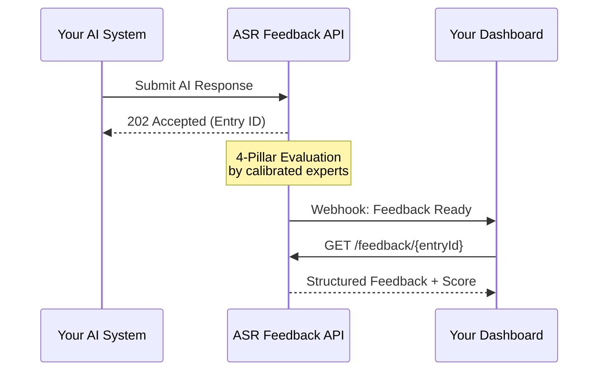

# Client Integration Guide

> **Document Version:** 2.3.0 | **Last Updated:** 2026-07-01 | **Audience:** Engineering Teams

---

## Table of Contents

- [Overview](#overview)
- [Integration Patterns](#integration-patterns)
- [Prerequisites](#prerequisites)
- [Step-by-Step Integration](#step-by-step-integration)
- [Authentication](#authentication)
- [Submitting Responses](#submitting-responses)
- [Receiving Feedback](#receiving-feedback)
- [Webhook Configuration](#webhook-configuration)
- [Error Handling](#error-handling)
- [Migration Guide (v1 → v2)](#migration-guide-v1--v2)
- [Troubleshooting](#troubleshooting)

---

## Overview

Integrating with the ASR Feedback platform enables your AI system to receive structured, multi-dimensional quality feedback on every response it generates. This guide walks you through the complete integration process, from initial setup to production deployment.

### What You'll Build



---

## Integration Patterns

| Pattern | Best For | Complexity | Latency |
|---|---|---|---|
| **REST API** | Custom integrations, full control | Medium | Synchronous submit, async feedback |
| **Python SDK** | Python-based AI pipelines | Low | Abstracted |
| **JavaScript SDK** | Web dashboards, Node.js services | Low | Abstracted |
| **Webhook** | Real-time notifications | Low | Push-based |
| **Batch Upload** | Historical data, bulk migration | Medium | Async |

---

## Prerequisites

Before starting integration:

1. **API Credentials** — Obtain your `client_id` and `api_key` from your account manager
2. **Endpoint URL** — Production: `https://api.asrfeedback.com/v2/` | Staging: `https://staging-api.asrfeedback.com/v2/`
3. **Schema Familiarity** — Review the [Feedback Schema](FEEDBACK_SCHEMA.md)
4. **Model Registration** — Register your AI models via the dashboard or API

---

## Step-by-Step Integration

### Step 1: Install the SDK

**Python:**
```bash
pip install asr-feedback-client
```

**JavaScript:**
```bash
npm install @asr-feedback/client
```

### Step 2: Initialize the Client

**Python:**
```python
from asr_feedback_client import ASRFeedbackClient

client = ASRFeedbackClient(
    client_id="YOUR_CLIENT_ID",
    api_key="YOUR_API_KEY",
    environment="production"  # or "staging"
)
```

**JavaScript:**
```javascript
import { ASRFeedbackClient } from '@asr-feedback/client';

const client = new ASRFeedbackClient({
    clientId: 'YOUR_CLIENT_ID',
    apiKey: 'YOUR_API_KEY',
    environment: 'production'
});
```

### Step 3: Submit an AI Response for Evaluation

**Python:**
```python
entry_id = client.submit_response(
    response_id="your-unique-response-id",
    model_id="gpt-4o-2025-08-06",
    user_query="What are the benefits of cloud computing?",
    ai_response="Cloud computing offers several key benefits...",
    domain="technology",
    task_type="question_answering",
    metadata={
        "temperature": 0.7,
        "max_tokens": 4096,
        "conversation_turn": 1
    }
)

print(f"Submitted for evaluation: {entry_id}")
# Output: Submitted for evaluation: FB-2026-0547-001
```

### Step 4: Retrieve Feedback

**Python:**
```python
# Poll for feedback (or use webhooks)
feedback = client.get_feedback(entry_id=entry_id)

if feedback.status == "completed":
    print(f"Quality Score: {feedback.quality_score.composite}")
    
    for good in feedback.pillars.good:
        print(f"  ✅ {good.category}: {good.description}")
    
    for bad in feedback.pillars.bad:
        print(f"  ❌ [{bad.severity}] {bad.category}: {bad.description}")
    
    for learned in feedback.pillars.learned:
        print(f"  📘 {learned.observation}")
    
    for memory in feedback.pillars.remember:
        print(f"  🧠 {memory.rule_text}")
```

### Step 5: Configure Webhooks

```python
client.configure_webhook(
    url="https://your-domain.com/asr-webhook",
    events=["feedback.completed", "session.completed", "alert.p0_detected"],
    secret="your-webhook-secret"
)
```

---

## Authentication

### API Key Authentication

All requests require authentication via API key in the `Authorization` header:

```http
POST /v2/responses HTTP/1.1
Host: api.asrfeedback.com
Authorization: Bearer YOUR_API_KEY
Content-Type: application/json
X-Client-ID: YOUR_CLIENT_ID
```

### Key Rotation

API keys can be rotated via the dashboard:
1. Navigate to **Settings → API Keys**
2. Click **Generate New Key**
3. Update your integration with the new key
4. Revoke the old key (grace period: 24 hours)

---

## Submitting Responses

### Request Format

```http
POST /v2/responses
Content-Type: application/json
Authorization: Bearer YOUR_API_KEY
```

```json
{
  "responseId": "your-unique-response-id",
  "modelId": "gpt-4o-2025-08-06",
  "provider": "OpenAI",
  "context": {
    "userQuery": "What are the benefits of cloud computing?",
    "aiResponse": "Cloud computing offers several key benefits...",
    "systemPrompt": "[Optional] Your system prompt",
    "conversationHistory": [],
    "domain": "technology",
    "taskType": "question_answering",
    "language": "en"
  },
  "priority": "standard",
  "metadata": {
    "temperature": 0.7,
    "maxTokens": 4096,
    "customTags": ["cloud", "benefits", "explainer"]
  }
}
```

### Response

```json
{
  "entryId": "FB-2026-0547-001",
  "sessionId": "SES-2026-0547",
  "status": "queued",
  "estimatedCompletionTime": "2026-07-01T16:30:00.000Z",
  "priority": "standard"
}
```

---

## Receiving Feedback

### Webhook Payload

When feedback is completed, you receive:

```json
{
  "event": "feedback.completed",
  "timestamp": "2026-07-01T14:23:45.000Z",
  "data": {
    "entryId": "FB-2026-0547-001",
    "responseId": "your-unique-response-id",
    "qualityScore": {
      "composite": 74,
      "band": "acceptable"
    },
    "summary": {
      "goodSignals": 2,
      "badSignals": 1,
      "learnings": 1,
      "memoryRules": 1
    },
    "detailUrl": "https://api.asrfeedback.com/v2/feedback/FB-2026-0547-001"
  }
}
```

---

## Error Handling

### HTTP Status Codes

| Status | Meaning | Action |
|---|---|---|
| `200` | Success | Process response |
| `202` | Accepted (async) | Entry queued, use webhook or poll |
| `400` | Bad Request | Fix request payload (see error details) |
| `401` | Unauthorized | Check API key |
| `403` | Forbidden | Check client permissions |
| `404` | Not Found | Entry ID doesn't exist |
| `422` | Validation Error | Request doesn't match schema |
| `429` | Rate Limited | Back off and retry |
| `500` | Server Error | Retry with exponential backoff |

### Retry Strategy

```python
# Built into the SDK
client = ASRFeedbackClient(
    client_id="YOUR_CLIENT_ID",
    api_key="YOUR_API_KEY",
    retry_config={
        "max_retries": 3,
        "backoff_factor": 2,
        "retry_on": [429, 500, 502, 503, 504]
    }
)
```

---

## Migration Guide (v1 → v2)

### Breaking Changes

| v1 | v2 | Migration |
|---|---|---|
| Flat feedback object | Nested 4-pillar structure | Restructure feedback parsing |
| `score` (pass/fail) | `qualityScore.composite` (0–100) | Update score handling |
| `POST /feedback` | `POST /v2/responses` | Update endpoint |
| API key in query param | API key in Authorization header | Update auth header |

### Migration Steps

1. **Update SDK** to v2.x
2. **Update endpoints** from `/feedback` to `/v2/responses`
3. **Update auth** from query parameter to Authorization header
4. **Update feedback parsing** to use the 4-pillar structure
5. **Update score handling** from pass/fail to composite 0–100
6. **Test in staging** before production cutover

---

## Troubleshooting

| Problem | Possible Cause | Solution |
|---|---|---|
| `401 Unauthorized` | Invalid or expired API key | Regenerate key in dashboard |
| `422 Validation Error` | Request doesn't match schema | Validate against [schema](../schemas/) |
| Webhook not firing | URL not reachable, wrong event types | Test with webhook debugger tool |
| Slow turnaround | High queue volume, non-priority submission | Check SLA tier, consider priority upgrade |
| Missing feedback fields | Evaluation still in progress | Check `status` field, wait for `completed` |

---

> **See Also:**
> - [API Reference →](../sdk/api-reference.md)
> - [Python SDK →](../sdk/python/)
> - [JavaScript SDK →](../sdk/javascript/)
> - [Feedback Schema →](FEEDBACK_SCHEMA.md)
