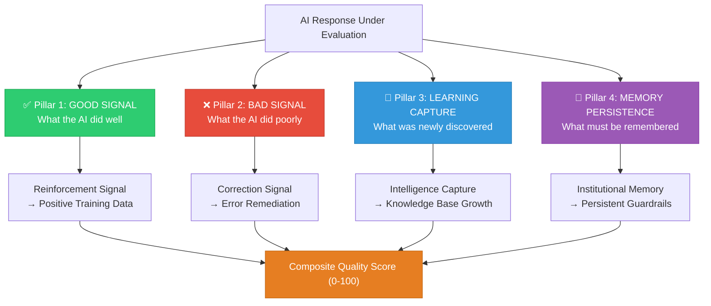
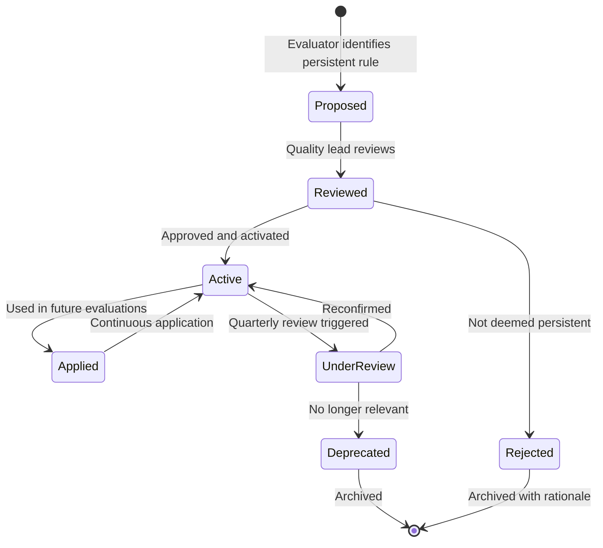
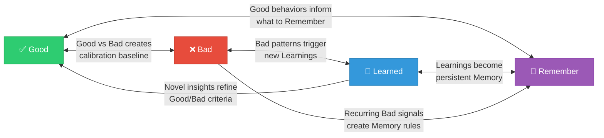
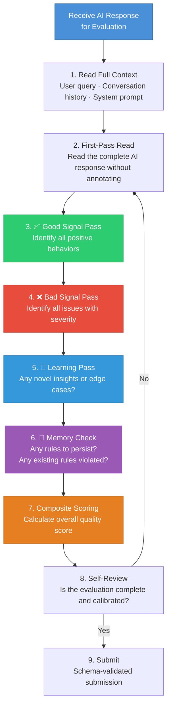
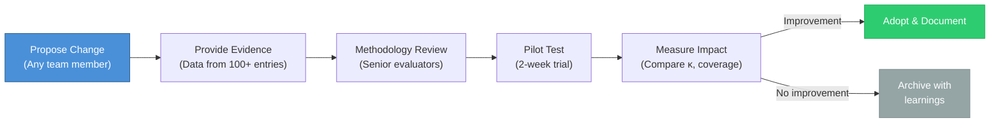

# 4-Pillar Feedback Methodology

> **Document Version:** 2.3.0 | **Last Updated:** 2026-07-01 | **Author:** ASR Methodology Team

---

## Table of Contents

- [Introduction](#introduction)
- [Theoretical Foundation](#theoretical-foundation)
- [The Four Pillars](#the-four-pillars)
- [Pillar 1: Good Signal (✅)](#pillar-1-good-signal-)
- [Pillar 2: Bad Signal (❌)](#pillar-2-bad-signal-)
- [Pillar 3: Learning Capture (📘)](#pillar-3-learning-capture-)
- [Pillar 4: Memory Persistence (🧠)](#pillar-4-memory-persistence-)
- [Inter-Pillar Relationships](#inter-pillar-relationships)
- [Evaluation Workflow](#evaluation-workflow)
- [Annotation Guidelines](#annotation-guidelines)
- [Inter-Rater Reliability](#inter-rater-reliability)
- [Calibration Procedures](#calibration-procedures)
- [Methodology Evolution](#methodology-evolution)

---

## Introduction

The **ASR 4-Pillar Feedback Methodology** is the intellectual foundation of everything we do. It defines *how* we evaluate AI-generated responses, *what* dimensions we capture, and *why* each dimension matters for continuous AI improvement.

This methodology was developed through 18 months of iterative refinement across 50,000+ feedback entries spanning 23 AI models, 12 industry domains, and 8 enterprise clients. It represents the distilled wisdom of what makes AI feedback actionable versus merely observational.

---

## Theoretical Foundation

### Why Traditional Feedback Fails

Most AI evaluation approaches fall into one of three traps:

```
┌─────────────────────────────────────────────────────────────────────┐
│                    THREE TRAPS OF AI FEEDBACK                       │
├──────────────────────┬──────────────────────┬──────────────────────┤
│   🔴 BINARY TRAP     │   🟡 HINDSIGHT TRAP  │   🔵 AMNESIA TRAP   │
├──────────────────────┼──────────────────────┼──────────────────────┤
│ "Good" or "Bad"      │ "The AI should have  │ "We fixed this       │
│ with no gradient.    │ known X" without     │ already... didn't    │
│ Loses nuance,        │ capturing X for      │ we?" No persistent   │
│ prevents learning    │ future training      │ memory of fixes      │
│ from partial success │                      │                      │
├──────────────────────┼──────────────────────┼──────────────────────┤
│ SOLUTION:            │ SOLUTION:            │ SOLUTION:            │
│ Multi-dimensional    │ 📘 Learning Capture  │ 🧠 Memory            │
│ scoring with         │ Pillar records       │ Persistence Pillar   │
│ Good + Bad signals   │ what should be       │ creates durable      │
│                      │ learned from         │ institutional rules  │
│                      │ each evaluation      │                      │
└──────────────────────┴──────────────────────┴──────────────────────┘
```

### Design Principles

| Principle | Application |
|---|---|
| **Completeness** | Every AI response is evaluated across all 4 pillars — none are skipped |
| **Specificity** | Feedback references exact quotes, line numbers, or response segments |
| **Actionability** | Every feedback entry maps to a concrete improvement action |
| **Traceability** | Every feedback entry is linked to a source response, session, and evaluator |
| **Calibration** | Evaluators are regularly calibrated to maintain inter-rater reliability ≥ 0.80 |

---

## The Four Pillars



---

## Pillar 1: Good Signal (✅)

### Purpose

Captures what the AI response did **well** — the behaviors, reasoning patterns, and output qualities that should be **reinforced** and replicated.

### Why It Matters

Identifying good performance is as critical as finding errors. Without explicit reinforcement signals:
- Models lose successful behaviors during fine-tuning
- Teams can't distinguish "mediocre but safe" from "excellent and innovative"
- Positive patterns aren't propagated across model versions

### Categories

| Category | Code | Description | Example |
|---|---|---|---|
| **Accurate Reasoning** | `GOOD_REASONING` | Correct logical chain, valid inferences | "Correctly identified the causal relationship between X and Y" |
| **Factual Accuracy** | `GOOD_FACTUAL` | Verifiable claims are correct | "All cited statistics match authoritative sources" |
| **Appropriate Tone** | `GOOD_TONE` | Tone matches context and audience | "Professional yet approachable for a B2B SaaS audience" |
| **Clear Structure** | `GOOD_STRUCTURE` | Well-organized, logical flow | "Used headers, bullet points, and progressive disclosure effectively" |
| **Relevant Context** | `GOOD_CONTEXT` | Demonstrates understanding of user's situation | "Correctly inferred the user's technical level from their question" |
| **Creative Solution** | `GOOD_CREATIVE` | Novel or insightful approach | "Proposed an alternative approach the user hadn't considered" |
| **Safety Compliance** | `GOOD_SAFETY` | Appropriate content filtering and disclaimers | "Included necessary medical disclaimer without being intrusive" |
| **Tool Usage** | `GOOD_TOOL_USE` | Effective use of available tools/APIs | "Used the search tool to verify a time-sensitive claim" |

### Scoring

```
Good Signal Score = (Σ category_weights × instance_counts) / max_possible_score × 100

Where:
  GOOD_REASONING  weight = 1.5  (highest value signal)
  GOOD_FACTUAL    weight = 1.5
  GOOD_CONTEXT    weight = 1.2
  GOOD_CREATIVE   weight = 1.2
  GOOD_STRUCTURE  weight = 1.0
  GOOD_TONE       weight = 1.0
  GOOD_SAFETY     weight = 1.0
  GOOD_TOOL_USE   weight = 1.0
```

---

## Pillar 2: Bad Signal (❌)

### Purpose

Detects what the AI response did **poorly** — errors, failures, and quality gaps that need **correction**.

### Why It Matters

This is the most intuitive pillar, but our methodology goes beyond simple error flagging:
- Every bad signal is **severity-classified** (P0–P4)
- Every bad signal is **root-cause analyzed** (why, not just what)
- Every bad signal generates a **remediation recommendation**

### Categories

| Category | Code | Description | Severity Range |
|---|---|---|---|
| **Hallucination** | `BAD_HALLUCINATION` | Fabricated facts, citations, or data | P0–P1 |
| **Reasoning Error** | `BAD_REASONING` | Flawed logic, invalid conclusions | P0–P2 |
| **Factual Error** | `BAD_FACTUAL` | Incorrect but verifiable claims | P1–P2 |
| **Context Miss** | `BAD_CONTEXT` | Misunderstood user intent or situation | P1–P3 |
| **Tone Mismatch** | `BAD_TONE` | Inappropriate tone for the context | P2–P3 |
| **Incompleteness** | `BAD_INCOMPLETE` | Missing critical information | P1–P3 |
| **Redundancy** | `BAD_REDUNDANT` | Unnecessary repetition or verbosity | P3–P4 |
| **Safety Violation** | `BAD_SAFETY` | Harmful, biased, or inappropriate content | P0 |
| **Format Error** | `BAD_FORMAT` | Poor structure, broken formatting | P3–P4 |
| **Tool Misuse** | `BAD_TOOL_USE` | Incorrect or unnecessary tool invocation | P2–P3 |

### Severity Classification

```
┌──────┬───────────────┬──────────────────────────────────────────────┐
│ Level│ Name          │ Criteria                                     │
├──────┼───────────────┼──────────────────────────────────────────────┤
│ P0   │ CRITICAL      │ User safety risk, data breach potential,    │
│      │               │ complete task failure, harmful content       │
├──────┼───────────────┼──────────────────────────────────────────────┤
│ P1   │ HIGH          │ Major factual errors, significant           │
│      │               │ hallucinations, core task incomplete         │
├──────┼───────────────┼──────────────────────────────────────────────┤
│ P2   │ MEDIUM        │ Moderate errors affecting output quality,   │
│      │               │ reasoning gaps, context misunderstanding     │
├──────┼───────────────┼──────────────────────────────────────────────┤
│ P3   │ LOW           │ Minor issues — tone, formatting, slight     │
│      │               │ redundancy, style preferences                │
├──────┼───────────────┼──────────────────────────────────────────────┤
│ P4   │ TRIVIAL       │ Cosmetic issues, nitpicks, suggestions      │
│      │               │ for marginal improvement                     │
└──────┴───────────────┴──────────────────────────────────────────────┘
```

---

## Pillar 3: Learning Capture (📘)

### Purpose

Records **novel insights, edge cases, and discoveries** that emerge during evaluation — knowledge that didn't exist before this specific review session.

### Why It Matters

This is the pillar that transforms ASR Feedback from an annotation service into an **intelligence operation**:

- Edge cases that no training dataset anticipated
- Cultural nuances that affect response quality in specific regions
- Domain-specific behaviors that only experts can identify
- Interaction patterns between model capabilities and user expectations

### Categories

| Category | Code | Description |
|---|---|---|
| **Edge Case Discovery** | `LEARN_EDGE_CASE` | Previously unknown input pattern that triggers unexpected behavior |
| **Domain Insight** | `LEARN_DOMAIN` | Industry-specific knowledge gap or strength identified |
| **Interaction Pattern** | `LEARN_INTERACTION` | How the model behaves across multi-turn conversations |
| **Cultural Nuance** | `LEARN_CULTURAL` | Region or culture-specific quality considerations |
| **Capability Boundary** | `LEARN_CAPABILITY` | Discovered limit of model ability in a specific area |
| **Prompt Sensitivity** | `LEARN_PROMPT` | How variations in prompt phrasing affect output quality |
| **Cross-Model Insight** | `LEARN_CROSS_MODEL` | Comparative insight across different AI models |

### Documentation Standard

Every learning entry must include:

```
1. CONTEXT      — What was the evaluation scenario?
2. OBSERVATION  — What was discovered?
3. EVIDENCE     — Specific examples from the response
4. IMPLICATION  — Why does this matter?
5. RECOMMENDED ACTION — What should be done with this insight?
```

**Example:**

```markdown
### Learning Entry: L-2026-0547

**Context:** Evaluating GPT-4o responses to medical triage questions in Hindi.

**Observation:** The model consistently recommends "consult a doctor" as the 
primary response, even when the user explicitly states they cannot access a 
doctor and asks for first-aid guidance.

**Evidence:** In 8 of 12 evaluated responses, the model defaulted to doctor 
referral without providing actionable first-aid steps that were explicitly 
requested.

**Implication:** The model's safety layer may be over-calibrated for medical 
topics in non-English languages, reducing utility for users with limited 
healthcare access.

**Recommended Action:** Flag for fine-tuning review. Consider adding balanced 
safety+utility responses for regions with limited healthcare infrastructure.
```

---

## Pillar 4: Memory Persistence (🧠)

### Purpose

Creates **durable institutional memory** — persistent rules, client preferences, and critical guardrails that must be applied across every future evaluation session.

### Why It Matters

Without Memory Persistence:
- The same error gets flagged session after session, but nothing changes
- Client preferences are forgotten when evaluators rotate
- Critical safety rules discovered in one session aren't applied in the next
- Organizations can't build cumulative improvement — every session starts from zero

### Categories

| Category | Code | Description | Persistence |
|---|---|---|---|
| **Client Preference** | `MEM_CLIENT_PREF` | Specific client requirements and preferences | Per-client, indefinite |
| **Safety Rule** | `MEM_SAFETY_RULE` | Critical safety guardrails | Global, indefinite |
| **Domain Rule** | `MEM_DOMAIN_RULE` | Industry-specific evaluation rules | Per-domain, indefinite |
| **Model Behavior** | `MEM_MODEL_BEHAVIOR` | Known model-specific behaviors and quirks | Per-model, review quarterly |
| **Correction Pattern** | `MEM_CORRECTION` | Recurring errors that need persistent monitoring | Until resolved |
| **Quality Standard** | `MEM_QUALITY_STD` | Calibration standards for specific scenarios | Until updated |

### Memory Lifecycle



### Example Memory Entries

```yaml
- id: MEM-2026-0089
  type: MEM_CLIENT_PREF
  client: "FinServ Corp"
  rule: "Never suggest specific financial products or investment strategies. 
         Always include regulatory disclaimer: 'This is not financial advice.'"
  created: 2026-01-15
  status: active
  applied_count: 847

- id: MEM-2026-0142
  type: MEM_SAFETY_RULE
  scope: global
  rule: "When a user describes symptoms of self-harm, the AI response MUST 
         include crisis helpline information as the first element, regardless 
         of the original query context."
  created: 2026-03-22
  status: active
  applied_count: 2341

- id: MEM-2026-0201
  type: MEM_MODEL_BEHAVIOR
  model: "claude-sonnet-4-20250514"
  rule: "Claude Sonnet tends to over-qualify statements with excessive hedging 
         in technical domains. Mark as BAD_REDUNDANT only if hedging reduces 
         clarity, not if it's appropriate caution."
  created: 2026-04-10
  status: active
  review_date: 2026-07-10
```

---

## Inter-Pillar Relationships

The four pillars are not independent — they interact and reinforce each other:



---

## Evaluation Workflow

### Single-Response Evaluation Flow



---

## Annotation Guidelines

### Core Rules

1. **Be Specific** — Reference exact quotes, sections, or line numbers. "The response was good" is not feedback. "The reasoning chain in paragraphs 2-3 correctly identifies the root cause by..." is feedback.

2. **Be Balanced** — Every response has both strengths and weaknesses. If you find zero Good signals or zero Bad signals, re-evaluate.

3. **Explain Why** — State the *reason* behind each annotation, not just the *observation*. "Hallucinated a citation" → "Hallucinated a citation to a non-existent IEEE paper, which could lead users to make decisions based on fabricated evidence."

4. **Use the Taxonomy** — Every annotation must map to a defined category code. If no existing category fits, propose a new one through the taxonomy update process.

5. **Check Memory** — Before scoring, consult the Memory Store for applicable persistent rules. Failure to apply an active memory rule is itself a quality issue.

6. **Calibrate Against Examples** — When unsure about severity, consult the calibration examples in the [Quality Framework](QUALITY_FRAMEWORK.md).

---

## Inter-Rater Reliability

### Target Metrics

| Metric | Threshold | Current |
|---|---|---|
| Cohen's Kappa (κ) — Overall | ≥ 0.80 | **0.87** |
| Cohen's Kappa (κ) — Severity | ≥ 0.85 | **0.89** |
| Krippendorff's Alpha — Categories | ≥ 0.80 | **0.84** |
| Percent Agreement — Good/Bad Binary | ≥ 90% | **93%** |

### Measurement Process

1. **Dual Evaluation:** 10% of all responses are independently evaluated by two evaluators
2. **Blind Comparison:** Neither evaluator sees the other's annotations until both submit
3. **Disagreement Resolution:** A senior evaluator adjudicates disagreements and documents the rationale
4. **Weekly Metrics:** Reliability metrics are computed weekly and reported to the quality lead

---

## Calibration Procedures

### New Evaluator Calibration

```
Phase 1: Training (5 days)
  - Study methodology documentation
  - Review 50 annotated examples
  - Shadow 10 live evaluation sessions

Phase 2: Calibration (3 days)
  - Independently evaluate 30 pre-scored responses
  - Compare against gold-standard annotations
  - Must achieve κ ≥ 0.75 to proceed

Phase 3: Supervised Production (10 days)
  - Evaluate live responses with 100% senior review
  - Receive feedback on every entry
  - Must achieve κ ≥ 0.80 for independent certification

Phase 4: Independent Production
  - Standard 10% dual-evaluation sampling
  - Monthly calibration refresher (5 responses)
```

### Ongoing Calibration

- **Monthly:** Every evaluator completes 5 calibration exercises
- **Quarterly:** Full re-calibration against updated gold-standard dataset
- **Triggered:** Automatic re-calibration if evaluator's κ drops below 0.80

---

## Methodology Evolution

This methodology is a living document. Changes follow a rigorous process:



---

> **See Also:**
> - [Feedback Schema →](FEEDBACK_SCHEMA.md)
> - [Quality Framework →](QUALITY_FRAMEWORK.md)
> - [Case Studies →](CASE_STUDIES.md)
> - [Taxonomy →](../taxonomy/)
