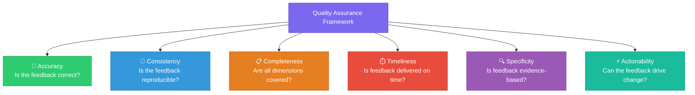
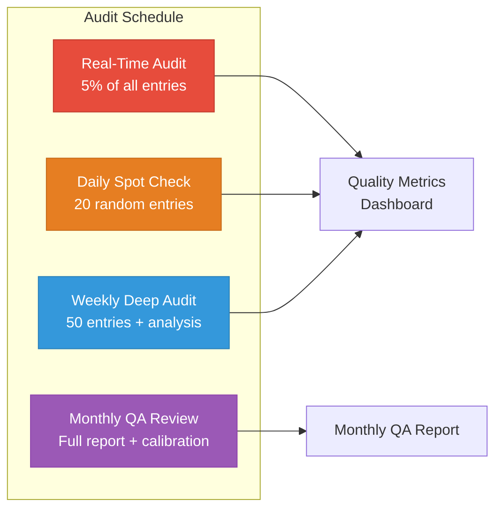
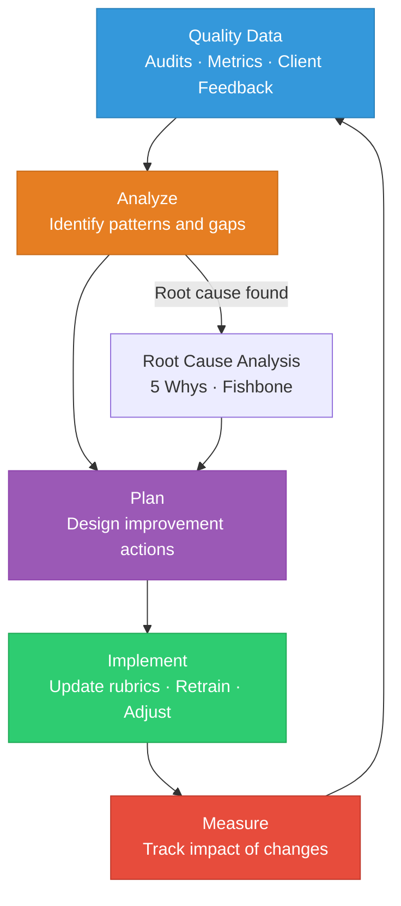

# Quality Assurance Framework

> **Document Version:** 2.3.0 | **Last Updated:** 2026-07-01 | **Author:** ASR Quality Team

---

## Table of Contents

- [Overview](#overview)
- [Quality Pillars](#quality-pillars)
- [Scoring Rubrics](#scoring-rubrics)
- [Audit Protocol](#audit-protocol)
- [Continuous Improvement](#continuous-improvement)
- [Quality Dashboards](#quality-dashboards)
- [Escalation Matrix](#escalation-matrix)

---

## Overview

The ASR Quality Assurance Framework ensures that every feedback entry we produce meets enterprise-grade standards for **accuracy**, **consistency**, **completeness**, and **timeliness**. This framework governs how we evaluate our own evaluators — the meta-quality layer that makes our service trustworthy.

### Quality Commitment

| Dimension | Standard | Measurement |
|---|---|---|
| **Accuracy** | Feedback correctly identifies issues and strengths | Validated by senior evaluator audit |
| **Consistency** | Same response receives consistent scores across evaluators | Inter-rater reliability (κ ≥ 0.80) |
| **Completeness** | All 4 pillars are addressed; no obvious signals missed | Completeness checklist score |
| **Timeliness** | Feedback delivered within SLA timeframe | Turnaround time tracking |
| **Specificity** | Feedback references exact evidence, not vague observations | Evidence citation rate |

---

## Quality Pillars

---

## Scoring Rubrics

### Evaluator Performance Rubric

| Dimension | Excellent (5) | Good (4) | Adequate (3) | Below Standard (2) | Unacceptable (1) |
|---|---|---|---|---|---|
| **Accuracy** | Zero factual errors in feedback | ≤1 minor factual error | ≤2 minor errors | Major error or misclassification | Multiple major errors |
| **Consistency** | κ ≥ 0.90 | κ ≥ 0.85 | κ ≥ 0.80 | κ ≥ 0.70 | κ < 0.70 |
| **Completeness** | All 4 pillars addressed, no missed signals | All 4 pillars, ≤1 missed minor signal | 3+ pillars addressed thoroughly | 2 pillars only | Single pillar or sparse |
| **Timeliness** | ≤50% of SLA time | ≤75% of SLA time | Within SLA | ≤10% over SLA | >10% over SLA |
| **Specificity** | 100% entries have exact evidence citations | ≥90% evidence citations | ≥80% evidence citations | ≥60% evidence citations | <60% evidence citations |
| **Actionability** | All entries have concrete remediation steps | ≥90% have remediation | ≥80% have remediation | ≥60% have remediation | <60% have remediation |

### Response Quality Scoring Guide

For evaluators applying quality scores to AI responses:

| Score Range | Classification | Criteria |
|---|---|---|
| **90–100** | Excellent | Comprehensive, accurate, well-structured. Zero P0/P1 issues. Strong Good signals across multiple categories. |
| **75–89** | Good | Accurate and useful with minor issues only (P3/P4). Good reasoning and structure. |
| **60–74** | Acceptable | Generally correct but with notable gaps. Some P2 issues. Adequate but not impressive. |
| **40–59** | Poor | Multiple significant issues (P1/P2). Missing critical information. Poor structure or tone. |
| **0–39** | Critical | P0 issues present (safety, hallucination). Fundamentally flawed response. Requires immediate remediation. |

---

## Audit Protocol

### Audit Types

### Real-Time Audit (5% Sampling)

- **Trigger:** Automated random selection of 5% of submitted entries
- **Reviewer:** Senior evaluator (calibration score ≥ 0.90)
- **Checklist:**
  - [ ] All 4 pillars addressed
  - [ ] Category codes correctly applied
  - [ ] Severity levels appropriately assigned
  - [ ] Evidence citations are specific and verifiable
  - [ ] Quality score is within ±5 of reviewer's independent score
  - [ ] Memory rules checked and applied
  - [ ] No PII in feedback text

### Daily Spot Check

- **Volume:** 20 randomly selected entries across all active evaluators
- **Focus:** Cross-evaluator consistency and emerging quality patterns
- **Output:** Quick-pass report to quality lead

### Weekly Deep Audit

- **Volume:** 50 entries, stratified by evaluator, domain, and model
- **Focus Areas:**
  1. Inter-rater reliability calculation
  2. Category code usage distribution
  3. Severity calibration check
  4. Learning pillar quality and novelty
  5. Memory rule compliance rate

### Monthly Quality Review

Comprehensive review covering:
- Full reliability metrics with trend analysis
- Evaluator performance scorecards
- Client-specific quality reports
- Methodology improvement proposals
- Calibration exercise results

---

## Continuous Improvement

### Feedback Loop Architecture

### Improvement Categories

| Category | Frequency | Owner |
|---|---|---|
| Rubric refinement | As needed, minimum quarterly | Methodology team |
| Evaluator coaching | Weekly for new, monthly for experienced | Quality lead |
| Taxonomy expansion | Monthly review, on-demand additions | Taxonomy committee |
| Tool improvements | Continuous | Engineering team |
| Process optimization | Quarterly | Operations lead |

---

## Quality Dashboards

### Key Dashboard Panels

| Panel | Metrics | Update Frequency |
|---|---|---|
| **Real-Time Monitor** | Active sessions, pending entries, SLA status | Live |
| **Evaluator Scorecard** | Per-evaluator accuracy, consistency, speed | Daily |
| **Reliability Tracker** | Cohen's κ trend, percent agreement | Weekly |
| **Client Quality** | Per-client composite scores, issue trends | Weekly |
| **Severity Distribution** | P0–P4 distribution over time | Daily |
| **Category Coverage** | Most/least used categories, gaps | Weekly |
| **Memory Compliance** | Rules applied vs. available, violations | Daily |

---

## Escalation Matrix

| Trigger | Severity | Action | Timeline | Owner |
|---|---|---|---|---|
| Evaluator κ < 0.80 | Medium | Mandatory re-calibration | Within 48 hours | Quality lead |
| Evaluator κ < 0.70 | High | Suspend from production, intensive retraining | Immediately | Quality lead + Manager |
| Missed P0 issue in audit | Critical | Incident review, client notification | Within 2 hours | Quality lead + Account manager |
| Client CSAT < 4.0 | High | Root cause analysis, improvement plan | Within 1 week | Account manager |
| SLA breach | High | Immediate capacity review, client communication | Within 4 hours | Operations lead |
| Systematic category misuse | Medium | Team calibration session | Within 1 week | Methodology lead |

---

> **See Also:**
> - [Methodology →](METHODOLOGY.md)
> - [Escalation Procedures →](../playbooks/escalation-procedures.md)
> - [Metrics & KPIs →](METRICS_AND_KPIs.md)
> - [SLA Definitions →](../compliance/sla-definitions.md)
